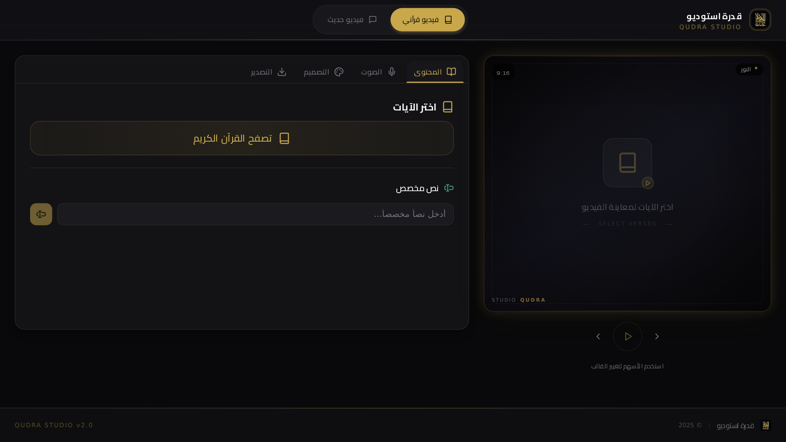

<div align="center">

# 🎬 قدرة ستوديو | Quadra Studio

## 📸 لقطات الشاشة | Screenshots



### صانع فيديوهات قرآنية احترافية لليوتيوب والتيك توك
### Quranic video maker for YouTube & TikTok with professional templates

[](https://quadra-studio.vercel.app)
[](https://github.com/ziadamr45/quadra_studio)

</div>

---

## 📖 نبذة

<div dir="rtl">

**قدرة ستوديو** هو تطبيق ويب متكامل لإنشاء فيديوهات قرآنية احترافية مخصصة لمنصتي اليوتيوب والتيك توك. يتيح للمستخدمين اختيار من بين تصميمات جاهزة متنوعة وأصوات قراء مشهورين لإنتاج محتوى قرآني عالي الجودة بسهولة وسرعة.

سواء كنت صانع محتوى دعوي أو تريد مشاركة آيات قرآنية بتصميمات جذابة — قدرة ستوديو يوفر لك كل ما تحتاجه في مكان واحد.

</div>

## ✨ المميزات

| الميزة | الوصف |
|--------|-------|
| 🎬 قوالب فيديو احترافية جاهزة | قوالب متنوعة وجاهزة للاستخدام |
| 🎙️ أصوات قراء مشهورين | مكتبة أصوات قراء معروفين |
| 📐 تصميمات مخصصة لليوتيوب والتيك توك | أحجام وتصميمات مناسبة للمنصات |
| 🎨 تخصيص كامل للألوان والخطوط | حرية كاملة في التخصيص |
| 📱 واجهة سهلة الاستخدام | تجربة استخدام سلسة وبسيطة |
| 🔄 معاينة مباشرة قبل التصدير | شاهد النتيجة قبل الحفظ |
| 🌙 وضع داكن/فاتح | اختر المظهر المناسب لك |
| 💾 حفظ المشاريع | احفظ مشاريعك للعودة إليها لاحقًا |

## 🛠️ التقنيات

| التقنية | الاستخدام |
|---------|-----------|
|  | إطار العمل الكامل |
|  | تطوير آمن بالأنواع |
|  | المعالجة الخلفية وتوليد الفيديو |
|  | التصميم |
|  | مكونات واجهة المستخدم |
|  | ORM لقاعدة البيانات |
|  | النشر والاستضافة |

## 🚀 التشغيل

### المتطلبات

- Node.js 18+ أو Bun
- Python 3.10+
- npm أو yarn أو bun

### التثبيت

```bash
# استنساخ المستودع
git clone https://github.com/ziadamr45/quadra_studio.git
cd quadra_studio

# تثبيت التبعيات
npm install
# أو
bun install

# إعداد متغيرات البيئة
cp .env.example .env
# عدّل ملف .env بالإعدادات الخاصة بك

# تشغيل تهجيرات قاعدة البيانات
npx prisma migrate dev

# تشغيل خادم التطوير
npm run dev
```

التطبيق سيعمل على `http://localhost:3000`

---

<div align="center">

Made with ❤️ by [Ziad Amr](https://github.com/ziadamr45)

</div>

---

## English

**Quadra Studio** is a comprehensive web application for creating professional Quranic videos tailored for YouTube and TikTok. Users can choose from a variety of ready-made templates and reciter voices to produce high-quality Quranic content with ease and speed.

Whether you're a Dawah content creator or simply want to share Quranic verses with beautiful designs — Quadra Studio provides everything you need in one place.

### Features

| Feature | Description |
|---------|-------------|
| 🎬 Professional video templates | Ready-to-use diverse templates |
| 🎙️ Famous reciter voices | Library of renowned reciter voices |
| 📐 YouTube & TikTok optimized layouts | Platform-appropriate sizes and designs |
| 🎨 Full color & font customization | Complete customization freedom |
| 📱 Easy-to-use interface | Smooth and simple user experience |
| 🔄 Live preview before export | See the result before saving |
| 🌙 Dark/Light mode | Choose your preferred theme |
| 💾 Save projects | Save projects to return to later |

### Tech Stack

| Technology | Purpose |
|------------|---------|
|  | Fullstack Framework |
|  | Type-safe Development |
|  | Backend Processing & Video Generation |
|  | Styling |
|  | UI Components |
|  | Database ORM |
|  | Deployment |

### Getting Started

#### Prerequisites

- Node.js 18+ or Bun
- Python 3.10+
- npm, yarn, or bun

#### Installation

```bash
# Clone the repository
git clone https://github.com/ziadamr45/quadra_studio.git
cd quadra_studio

# Install dependencies
npm install
# or
bun install

# Set up environment variables
cp .env.example .env
# Edit .env with your configuration

# Run database migrations
npx prisma migrate dev

# Start development server
npm run dev
```

The app will be available at `http://localhost:3000`

---

<div align="center">

Made with ❤️ by [Ziad Amr](https://github.com/ziadamr45)

</div>
